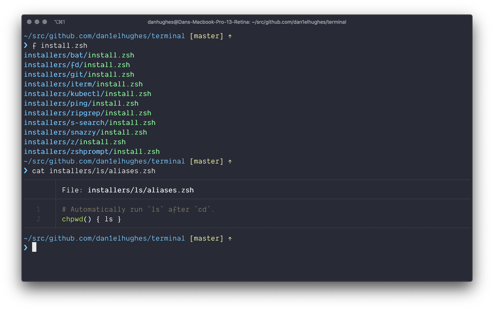

# terminal



Installer for my terminal programs, aliases and functions.

Every program, config and alias is optional.

## Usage

- Install [`oh-my-zsh`](https://github.com/ohmyzsh/ohmyzsh).
- Run `./install.sh` and follow the prompts.
- Close and reopen your terminal.

## Components

**All optional.**

### Installed programs

- [`bat`](https://github.com/sharkdp/bat) (aliased to `cat`).
- [`fd`](https://github.com/sharkdp/fd) (aliased to `f`).
- [`prettyping`](https://github.com/denilsonsa/prettyping) (aliased to `ping`).
- [`ripgrep`](https://github.com/BurntSushi/ripgrep).
- [`s-search`](https://github.com/zquestz/s) (aliased to `s`).
- [`z`](https://github.com/rupa/z) directory navigator.

### Theme

To enable, set your theme in `~/.zshrc`:

```bash
ZSH_THEME="dan1elhughes-terminal"
```

### Git config

- Installs the aliases from my [`gitconfig`](https://github.com/dan1elhughes/gitconfig).

### Other

Installs:

- [`iterm2`](https://iterm2.com/) (terminal).
- [`snazzy`](https://github.com/sindresorhus/iterm2-snazzy) (iterm theme).

## Local configuration

- Create `installers/local/config.zsh` and re-run the installer.

```sh
# installers/local/config.zsh

# Token for `hub` cli tool.
export GITHUB_TOKEN="abcde"
```

## Development

### Create a new installer

Assuming `foo` is the name of the app.

```sh
util/scaffold.sh foo
```
